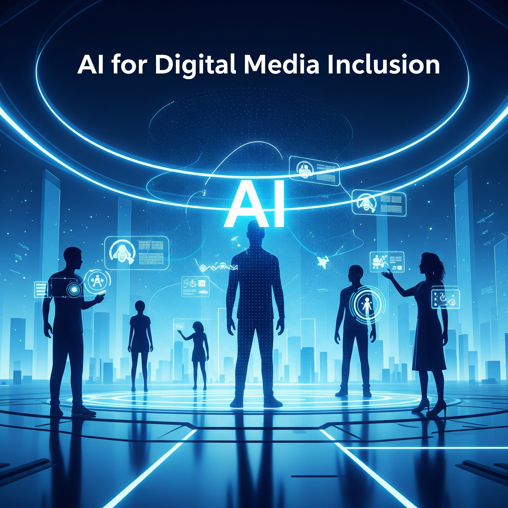

# Awesome AI for Digital Media Inclusion!

 <!-- omit in toc -->
📖 A curated list of resources dedicated to the CDT in AI for Digital Media Inclusion by PhD researchers from the programme (https://www.surrey.ac.uk/artificial-intelligence/cdt)

   

Generate an image for "AI for Digital Media Inclusion". Generated by <a href="https://gemini.google.com/app">Gemini Pro 2.5</a>.

**CONTRIBUTIONS WELCOMED!**

🔥 This project is actively maintained, and we welcome your contributions. If you have any suggestions, such as missing papers or information, please feel free to open an issue or submit a pull request ✅

If you find this repository useful, please give it a star 👉 ⭐

---

***Keys***

+  = text-based or has text option.
+  = video-based or has video option.
+  = audio-only or has audio-only option.
+  = published/pre-print available.
+  = paid for/has paywall.
+  = free access.

**Quick Navigation**:
- [Fundamentals](#fundamentals)
- [Research Methods](#research-methods)
- [Inclusion](#inclusion)
- [Digital Media](#digital-media)
- [Research Papers](#research-papers)
- [Benchmarks](#benchmarks)
- [Projects](#projects)

---

## Contents
- [Fundamentals](#fundamentals)
    - [Programming](#programming)
    - [AI and Machine Learning](#ai-and-machine-learning)
    - [Inclusive Foundations](#inclusive-foundations)
    - [Creative Technologies](#creative-technologies)
    - [PhD-Level Research](#phd-level-research)
    - [User-Centred Design](#user-centred-design)
- [Research Methods](#research-methods)
- Awaiting contributions!
- [Inclusion](#inclusion)
- Awaiting contributions!
- [Digital Media](#digital-media)
- Awaiting contributions!
- [Research Papers](#research-papers)
- Awaiting contributions!
- [Benchmarks](#benchmarks)
- Awaiting contributions!
- [Projects](#projects)
- Awaiting contributions!

---

## Fundamentals
### Programming

### AI and Machine Learning
+ [Generative AI exists because of the transformer](https://ig.ft.com/generative-ai/) An accessible and interactive article by The Finanical Times on one of the biggest breakthroughs in AI, the Transformer.

+ [DeepLearning.AI](https://www.deeplearning.ai/courses/) These are short courses and cover a wide range of AI topics. Explore the beginner courses first before the other steps as it will give you a taste of what the field is about and like. Especially the **AI for Beginners** course: https://www.deeplearning.ai/short-courses/ai-python-for-beginners/

    

+ [Machine Learning Guide](https://ocdevel.com/mlg) A great podcast series which builds up from zero to machine learning engineer topics. It provides lots of advice about starting out, what certain things means and routes into the field and lots of resources are provided.

    

+ [Machine Learning Specialisation by Andrew Ng](https://www.coursera.org/specializations/machine-learning-introduction) The "famous" course series by Andrew Ng. The video content is free to access but the programming practice labs in Python you have to pay for.

    

+ [Machine Learning by StatQuest](https://www.youtube.com/playlist?list=PLblh5JKOoLUICTaGLRoHQDuF_7q2GfuJF).

+ [The 100 Page Machine Learning Book](https://themlbook.com/).
    
    

+ [The 100 Page Language Models Book](https://www.thelmbook.com/).

    

+ 

### Inclusive Foundations
### Creative Technologies
### User-Centred Design